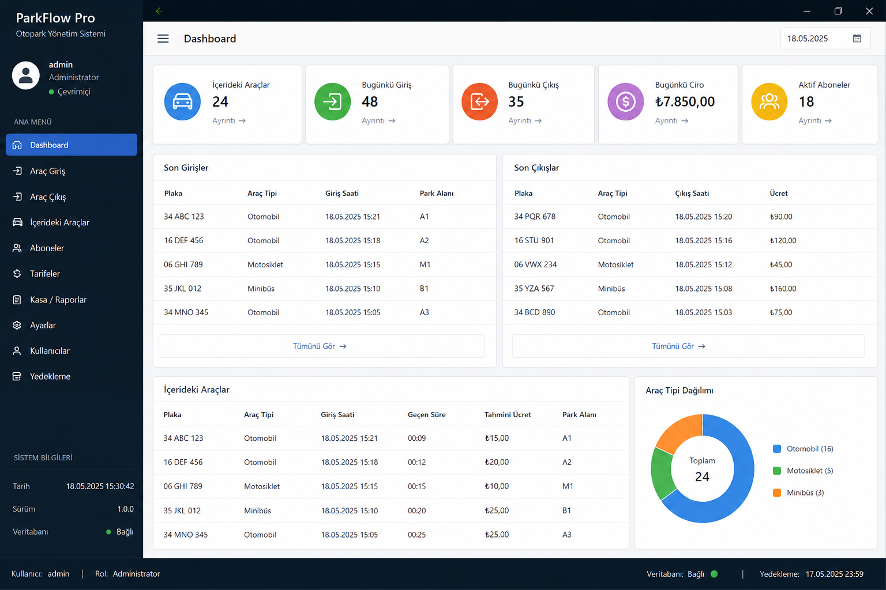
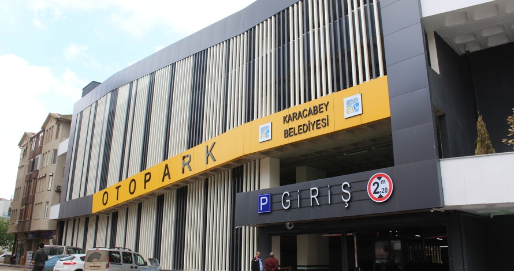

# ParkFlow Pro

**ParkFlow Pro**, Delphi FireMonkey ile hazırlanmış, Windows ve macOS üzerinde çalışacak şekilde tasarlanmış profesyonel bir otopark takip sistemi başlangıç projesidir.

Bu sürüm; araç giriş/çıkış, ücret hesaplama, içerideki araçlar, aboneler, günlük kasa özeti, ücret tarifesi ve temel ayarlar ekranlarını içerir.





## Neden FireMonkey?

Delphi VCL sadece Windows içindir. Bu proje Windows + macOS hedeflediği için **FireMonkey / FMX** ile hazırlanmıştır.

## Teknolojiler

- Delphi 12 Athens veya Delphi 11 Alexandria önerilir
- FireMonkey / FMX
- FireDAC
- SQLite
- Katmanlı mimari

## Proje Yapısı

```text
src/
  ParkFlowPro.dpr
  ParkFlowPro.dproj
  App/
    uAppTypes.pas
    uAppPaths.pas
  Infra/
    uDatabase.pas
  Security/
    uPasswordHasher.pas
  Services/
    uAuthService.pas
    uTariffService.pas
    uSubscriberService.pas
    uParkingService.pas
    uReportService.pas
    uSettingsService.pas
  UI/
    uMainForm.pas
```

## İlk Çalıştırma

1. RAD Studio / Delphi ile `src/ParkFlowPro.dproj` dosyasını açın.
2. Target platform olarak Windows 64-bit veya macOS 64-bit seçin.
3. Build alın.
4. Uygulamayı çalıştırın.

İlk açılışta SQLite veritabanı otomatik oluşturulur.

Varsayılan kullanıcı:

```text
Kullanıcı adı: admin
Şifre: admin123
```

İlk girişten sonra gerçek projede bu şifre değiştirilmelidir.

## Veritabanı Konumu

Uygulama verisini kullanıcı dokümanları altında tutar:

```text
Documents/ParkFlowPro/parkflowpro.db
```

Bu yaklaşım Windows ve macOS için güvenlidir, Program Files / App Bundle içine yazmaya çalışmaz.

## Mevcut Modüller

- Login
- Dashboard
- Araç giriş
- Araç çıkış
- İçerideki araçlar
- Abonelik yönetimi
- Ücret tarifeleri
- Kasa raporu
- Ayarlar

## Ücret Hesaplama Mantığı

- İlk 60 dakika için `first_hour_fee` uygulanır.
- 60 dakikadan sonraki süre üst saate yuvarlanır.
- Aktif abone plakaları için ücret `0` kabul edilir.
- Günlük maksimum ücret tanımlıysa ücret bu değeri geçmez.

Örnek:

```text
İlk saat: 50 TL
Sonraki saat: 30 TL
Süre: 2 saat 20 dakika
Ücret: 50 + 30 + 30 = 110 TL
```

## Profesyonel Geliştirme Notları

Bu zip, build edilebilir bir başlangıç projesi olarak tasarlandı. Gerçek müşteriye teslim öncesi önerilen ekler:

- Şifre değiştirme ekranı
- Kullanıcı rol/yetki matrisi
- Fiş / termal yazıcı entegrasyonu
- Yedekleme ve geri yükleme
- Log sistemi
- Plaka kamera entegrasyonu
- Setup.exe / installer paketi
- macOS notarization ve Windows code signing

## Windows Build

RAD Studio içinde:

```text
Target Platforms > Windows 64-bit > Build
```

## macOS Build

macOS build için Delphi tarafında PAServer bağlantısı gerekir:

1. Mac üzerinde PAServer çalıştırın.
2. RAD Studio > Tools > Options > Deployment > Connection Profile oluşturun.
3. Target Platforms > macOS 64-bit seçin.
4. Build / Deploy çalıştırın.

## Not

Bu projede UI bileşenleri kodla oluşturuldu. Böylece `.fmx` tasarım dosyalarına bağımlılık azalır ve zip içinde taşınması kolay, okunabilir bir başlangıç mimarisi elde edilir.
